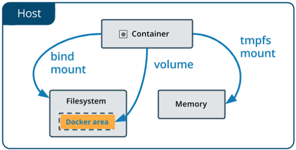
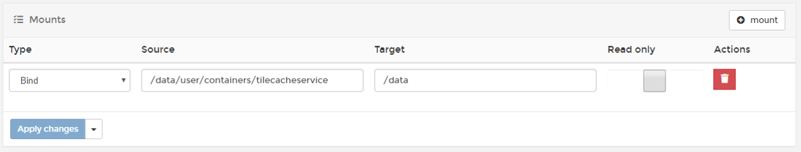
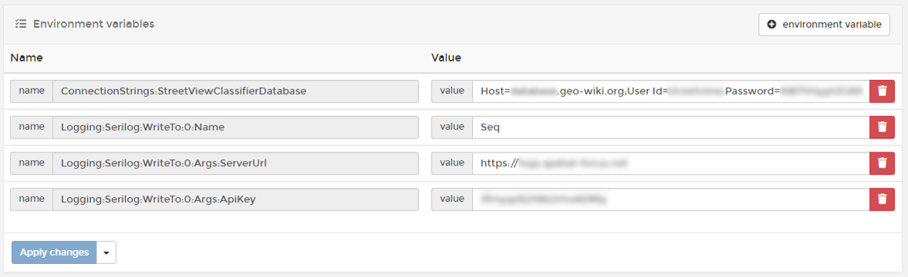
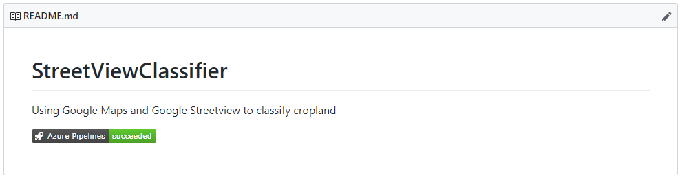

# Advanced Docker

Developer Brown-bag Lunch

Nov 2018

---

### Agenda

- Persistent storage
- Service settings
- MyBoilerplate
- CI (Automated build and deployment)

---

### Persisted storage I – Options 



- @size[.7em](Volumes - stored in a part of the host filesystem BUT managed by Docker)
- @size[.7em](Bind mount – “shared” folder from the host. Non-Docker processes on the host can modify them at any time)
- @size[.7em](Tmpfs - in the host system’s memory only)

---

### Persisted storage II – Available Shares

- Using our SAMBA machines, we have shares on the docker hosts (docker1-4 and dockerl1-4)
- 3 different SAMBA shares:
  - _user_: Primary share for all productive use cases (docker services)
  - _data_: Used generic for any kind of data (exports, backups, etc.)
  - _system_: Used administratively (e.g. Postgres WAL for clustered DB)
- In Windows nodes we have access to __U:\\__, which represents the ‘user’ share
  - Should be “bound” to __c:\data__ by default
- In Linux nodes we have access to __/data/user__, which represents the ‘user’ share
  - Should be “bound” to __/data__ by default

---

### Persisted storage III – Usage 

- Each service gets it’s own folder under the user share
  - /data/user/containers/\[service-name](-dev)
  - U:\containers\\\[service-name](-dev)
- Bind mount can simply be defined in Portainer:



Bind /data/user/containers/tilecacheservice /data

---

### Service settings I – Background

- Some settings shouldn’t be present in source code
  - DB connection strings
  - API Keys
  - Any other passwords, etc.
- Or should be adjustable depending on the runtime environment
  - Logging endpoint
  - Connection string
- Inject them into the services using Environment Variables
  - ```
	docker service create --env DEBUG=1 ...
	```
  - ```
	environment:
	  DEBUG=1
	```
	
---

### Service settings II - Suggestions

- Use environment variables to override default appsettings.json values
  ```csharp
  config.AddJsonFile("appsettings.json", false, true);
  config.AddJsonFile($"appsettings.{env.EnvironmentName}.json", true, true);
  config.AddEnvironmentVariables();
	```

- Use Options Pattern in ASP.NET Core, which supports DI
  ```
  services.Configure<MyOptions>(Configuration);

  public DefaultController(ILogger<DefaultController> logger, IOptions<ServiceOptions> serviceOptions, ...) 
  { 
  ```

---

### Service settings III – Portainer example



---

### MyBoilerplate

#### [https://github.com/pergerch/MyBoilerplate](https://github.com/pergerch/MyBoilerplate)

- ASP.NET Core 2.1 API
- Docker
- Settings (Appsettings, Environment variables, Options Pattern)
- Automapper
- SEQ Logging
- EF Core (DbContext, Entities, Proxies, Repositories, Spatial Focus extension)
- Stylecop + Analyzers
- Resharper config

---

### Continuous Integration I

- Trigger the Azure pipeline on merging of pull requests
- Add build badge :cool:



---

### Continuous Integration II

- Deactivate commits to master branch
  - Settings - Branch protection rules
- Setup Azure pipeline
  - docker-compose build
  - docker push
  - call Portainer webhook
